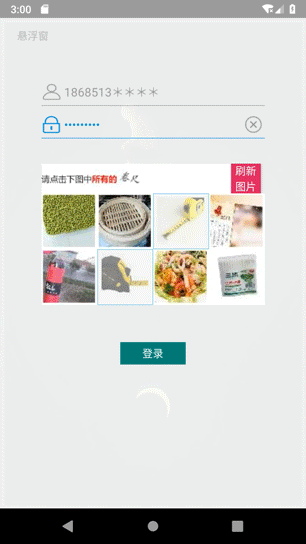
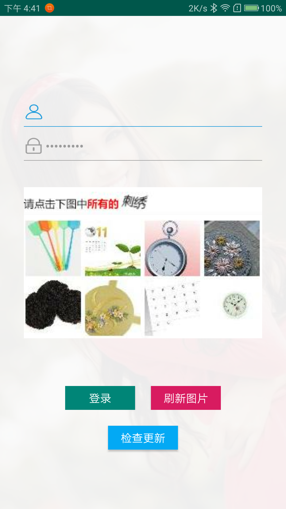

### 这是一个模拟登录12306的android应用
#### 目前实现的功能
  - [x] 欢迎页 (爬虫爬取百度图片作为欢迎图片,并可设置爬取的图片类型,如漫画、明星等)
  - [x] 登录页 (利用现有的OCR和图片分类模型实现自动选择验证码，两个模型均是Tensorflow实现)
  - [x] 详情页 (暂时用ListView展示自己在12306填写的信息及联系人信息)
  - [x] 历史订单页 (暂时实现查询一个月内的历史订单)
  - [x] 订票页 (暂时实现按日期地点查询某天的余票情况，点击购买功能未实现)
  - [x] 退出功能 (登录后可以退出并返回登录页面)
  - [x] 升级功能 (实现下载App并安装，但下载的是wifi万能钥匙，后面再真的实现升级功能)
  - [ ] 其他功能 (想到一出是一出, 随时添加)
#### 自动选择验证图片

#### 编译好的App
  - [下载体验](https://raw.githubusercontent.com/Mycheny/client12306/master/app-release/12306.apk)
#### 部分页面展示
  - ##### 欢迎页

  - ##### 登录页

  - ##### 订票页
